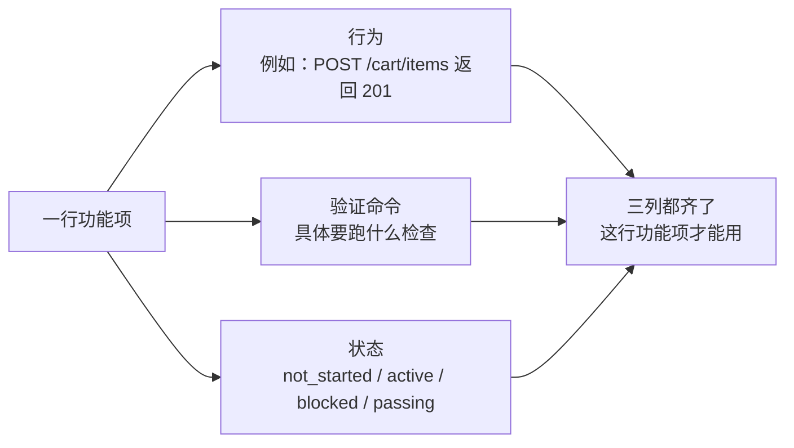
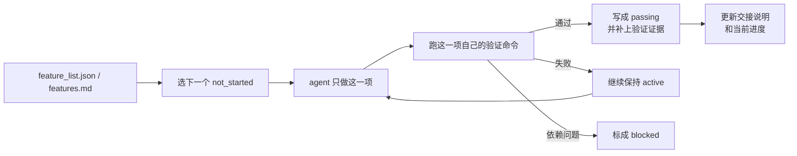

[English Version →](../../../en/lectures/lecture-08-why-feature-lists-are-harness-primitives/)

> 本篇代码示例：[code/](https://github.com/walkinglabs/learn-harness-engineering/blob/main/docs/zh/lectures/lecture-08-why-feature-lists-are-harness-primitives/code/)
> 实战练习：[Project 04. 用运行反馈修正 agent 的行为](./../../projects/project-04-incremental-indexing/index.md)

# 第八讲. 用功能清单约束 agent 该做什么

> 工程建议：这里的数字阈值是可调整的教学默认值，不是实验确认的分界线。token 数取决于分词器和内容，不能只按行数推算。

一个常见的场景：让 agent 做一个电商网站，跑完之后它告诉你"做完了"。但你打开代码一看，用户认证有了，但购物车的结算按钮点了没反应，支付流程根本没接上。问题的根源在于：没有告诉过它"做完"的具体标准，所以它用自己的标准来判断——"代码写了不少，看起来挺完整"。

功能清单（feature list）在很多人眼里就是个备忘录，写下来怕忘了，写完扔在一边。但在 harness 的世界里，功能清单是整个 harness 的基础结构。调度器靠它选任务，验证器靠它判完成，交接器靠它生成报告。没有它，这些组件就没有可以依赖的共识。

Anthropic 和 OpenAI 都强调：**工件必须外部化**。功能状态必须是仓库里机器可读的文件，不能是对话里的非结构化描述。

## Agent 缺少明确的完成标准

Claude Code 和 Codex 都不会自动知道你心目中的"做完"是什么意思。你说"加一个购物车功能"，模型的理解可能是"写一个 Cart 组件和 addToCart 方法"。而你的意思是"用户能从浏览商品到下单支付完整走通"。

这个理解鸿沟在没有功能清单的情况下会持续存在。agent 用自己的隐式标准判断完成，通常是"代码没有明显的语法错误"。而你需要的是端到端的行为验证。没有清单，双方对"做完"的理解始终是对不上的。

看看这种常见的进度记录：

```
做了用户认证、购物车基本完成了、还需要做支付
```

新的 agent 会话看到这个记录，能回答以下问题吗？"基本完成"意味着什么？购物车通过了哪些测试？支付的阻塞条件是什么？答案都是"不知道"。

把进度和验证结果记录在版本化文件中，让下一次会话能检查项目状态。引用原文介绍了这个机制，没有报告启动耗时减少的百分比。 [Anthropic](https://www.anthropic.com/engineering/effective-harnesses-for-long-running-agents)

## 功能状态机





## 核心概念

- **功能清单是 harness 原语**：它是所有 harness 组件依赖的基础数据结构。调度器、验证器、交接器都要读取它才能工作。
- **三元组结构**：每个功能项包含三个要素：`(行为描述, 验证命令, 当前状态)`。行为描述告诉 agent 做什么，验证命令告诉它怎么算做完，状态告诉它现在到哪了。缺了任何一项，这个功能项就不完整。
- **状态机模型**：每个功能项有四种状态：`not_started`、`active`、`blocked`、`passing`。状态转移由 harness 控制，不是 agent 想改就能改。
- **通过状态门控**：功能从 `active` 变成 `passing` 的唯一方式是验证命令执行成功。这个转移是不可逆的，`passing` 了就不能退回去。
- **单一权威来源**：项目里关于"该做什么"的所有信息，必须从一个功能清单派生。不能出现功能清单和对话记录矛盾的情况。
- **反向压力**：还没通过的功能项数量就是 harness 对 agent 施加的压力。压力归零 = 项目完成。

## 为什么功能清单必须是原语

文档是给人看的，原语是给系统用的。文档可以被忽略，原语不能被绕过。

可以类比数据库的触发器约束和应用层的检查逻辑：前者由数据库引擎强制执行，任何 SQL 都无法跳过；后者依赖于应用代码的正确性，可能被意外绕过。功能清单作为 harness 原语，承担的就是数据库级别的约束角色，agent 不能绕过它。

具体来说，功能清单服务四个 harness 组件：

1. **调度器**：读状态，选下一个 `not_started` 的功能。
2. **验证器**：执行验证命令，判断是否允许状态转移。
3. **交接报告器**：从功能清单自动生成会话交接摘要。
4. **进度追踪器**：统计各状态分布，提供项目健康度指标。

## 实施方法

### 1. 定义一个最小化的功能清单格式

不需要复杂的系统，一个结构化的 Markdown 或 JSON 文件就够了。关键是每个条目必须有三元组：

```json
{
  "id": "F03",
  "behavior": "POST /cart/items with {product_id, quantity} returns 201",
  "verification": "curl -X POST http://localhost:3000/api/cart/items -H 'Content-Type: application/json' -d '{\"product_id\":1,\"quantity\":2}' | jq .status == 201",
  "state": "passing",
  "evidence": "commit abc123, test output log"
}
```

### 2. 让 harness 控制状态转移

agent 不能直接把状态改成 `passing`。它只能提交验证请求，harness 执行验证命令，根据结果决定是否允许状态转移。这就是"通过状态门控"。

### 3. 在 CLAUDE.md 里写清楚规则

```
## 功能清单规则
- 功能清单文件: /docs/features.md
- 每次只激活一个功能项
- 功能项验证命令必须通过才能标为 passing
- 不要修改功能清单的状态，由验证脚本自动更新
```

### 4. 粒度校准

每个功能项应该是"一次会话能完成"的范围。太粗了做不完，太细了管理开销大。"用户可以添加商品到购物车"是一个好粒度，"实现购物车"太粗了，"创建 Cart 模型的 name 字段"太细了。

## 教学示意

> 教学示意：这个场景及其中的数字是为解释机制设定的，不是已发表实验的实测结果。

一个电商平台的开发任务，10 个功能项。对比两种追踪方式：

**备忘录模式**：agent 用非结构化笔记记录进度。3 个会话后，笔记变成了"做了用户认证和商品列表、购物车基本完成但还有 bug、支付没开始"。新会话需要 20 分钟推断状态，最终重复实现了已完成的功能。

**结构化模式**：每个功能项有明确的状态和验证命令。新会话读取功能清单，3 分钟内知道：F01-F05 是 `passing`，F06 是 `active`（正在做），F07-F10 是 `not_started`。直接从 F06 继续，零重复。

## 核心要点

- **功能清单是 harness 的基础结构**，不是给人看的备忘录。调度器、验证器、交接器都依赖它。
- **每个功能项必须有三元组**：行为描述 + 验证命令 + 当前状态。缺一项就不完整。
- **状态转移由 harness 控制**，agent 不能自己改状态。通过验证是唯一的升级路径。
- **功能清单是项目的单一权威来源**，任何关于"该做什么"的信息都从这里派生。
- **粒度控制在"一次会话能完成"的范围**。太粗做不完，太细管不过来。

## 延伸阅读

- [Building Effective Agents - Anthropic](https://www.anthropic.com/research/building-effective-agents) — 明确指出功能列表是控制 agent 执行范围的"核心数据结构"
- [Harness Engineering - OpenAI](https://openai.com/index/harness-engineering/) — 强调"将工件外部化"的原则
- [Design by Contract - Bertrand Meyer](https://www.goodreads.com/book/show/130439.Object_Oriented_Software_Construction) — 契约式设计原则，功能列表的理论基础
- [How Google Tests Software](https://books.google.dk/books/about/How_Google_Tests_Software.html?id=VrAx1ATf-RoC&redir_esc=y) — 测试金字塔和行为规格的工程实践

## 练习

1. **功能清单设计**：定义一个最小化的功能清单 JSON schema。包含：id、行为描述、验证命令、当前状态、证据引用。用它描述一个包含 5 个功能的真实项目。

2. **验证严格性对比**：选 3 个功能，分别设计"宽松"验证（如"代码无语法错误"）和"严格"验证（如"端到端测试通过"）。对比两种验证下的假阳性率。

3. **单一来源原则审查**：审查一个已有的 agent 项目，检查是否存在与功能清单矛盾的范围信息（对话里的隐式需求、代码里的 TODO 注释等）。设计一个方案，把所有信息统一到功能清单中。
